# AZ-305 Lab — Architecture Documentation

> **Lab Purpose:** Hands-on Terraform lab for the AZ-305 (Designing Microsoft Azure Infrastructure Solutions) certification exam. 13 modules deploy real Azure resources mapped to each exam domain.

---

## Table of Contents

1. [Overall Architecture Diagram](#1-overall-architecture-diagram)
2. [Per-Module Architecture Diagrams](#2-per-module-architecture-diagrams)
3. [Resource Inventory Table](#3-resource-inventory-table)
4. [Dependency Map](#4-dependency-map)
5. [Network Topology Diagram](#5-network-topology-diagram)
6. [Exam Domain Mapping](#6-exam-domain-mapping)

---

## 1. Overall Architecture Diagram

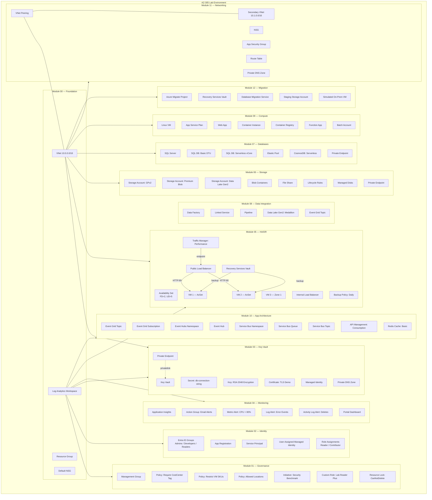

---

## 2. Per-Module Architecture Diagrams

### Module 00 — Foundation

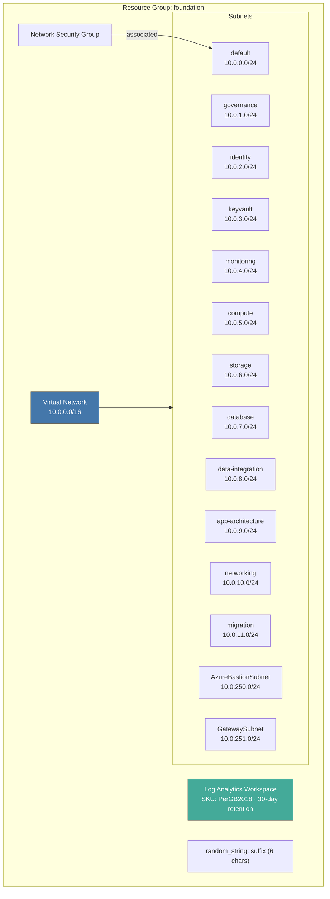

### Module 01 — Governance & Compliance

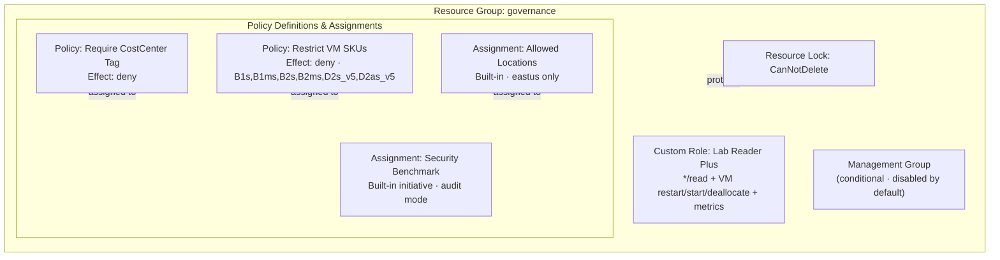

### Module 02 — Identity & Access

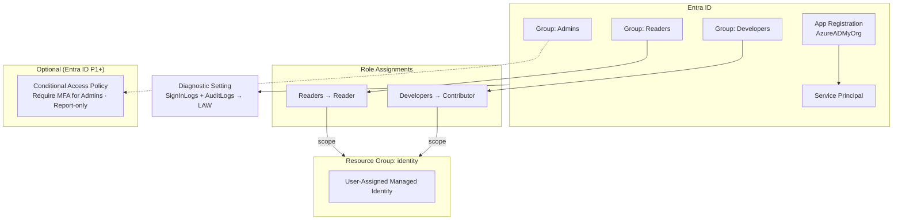

### Module 03 — Key Vault & Application Identity

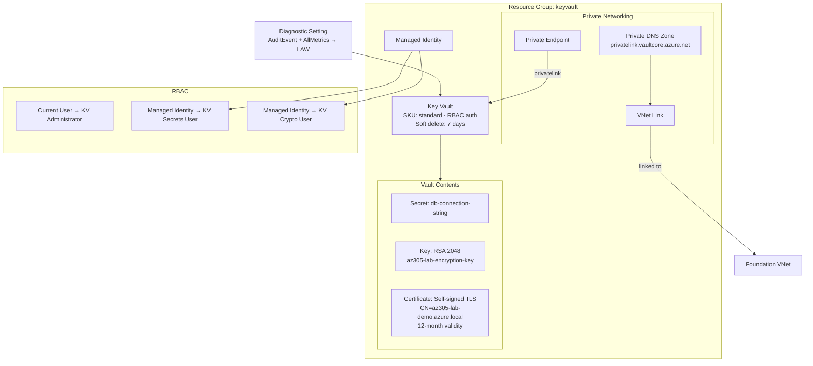

### Module 04 — Monitoring & Alerting

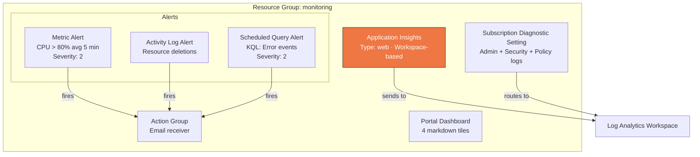

### Module 05 — High Availability & Disaster Recovery

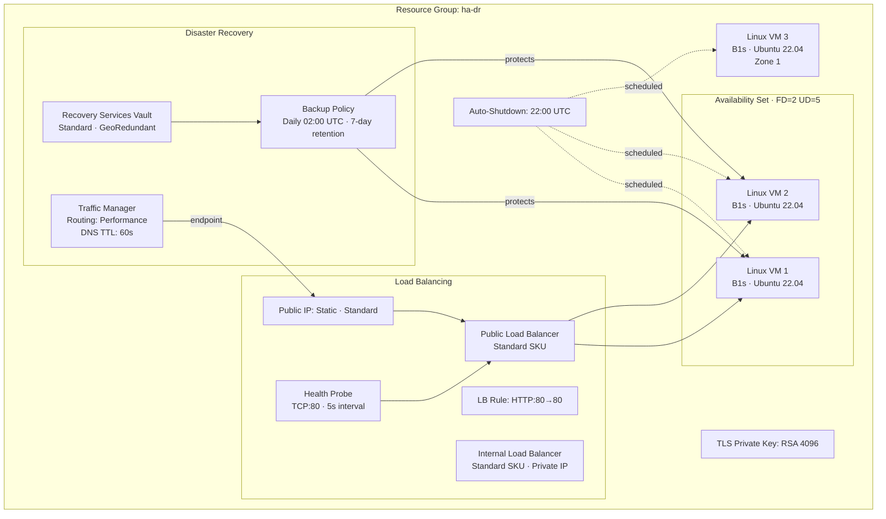

### Module 06 — Storage Solutions

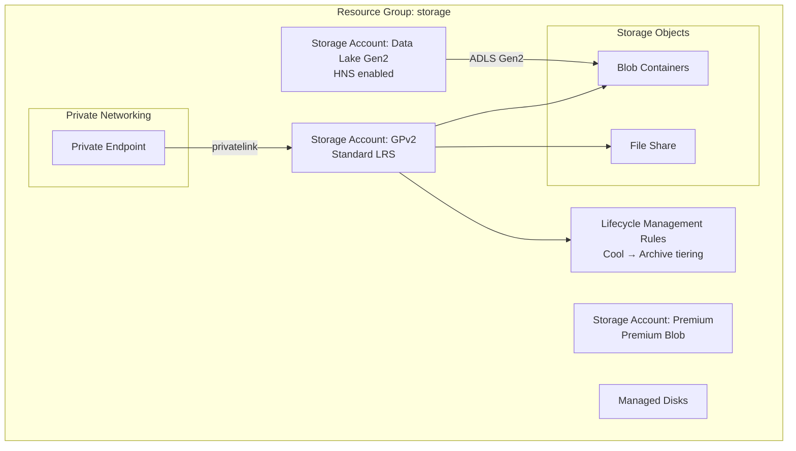

### Module 07 — Databases

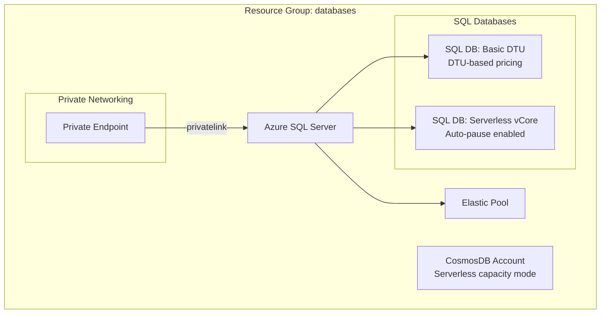

### Module 08 — Data Integration

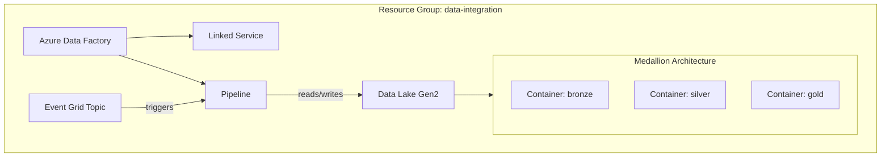

### Module 09 — Compute

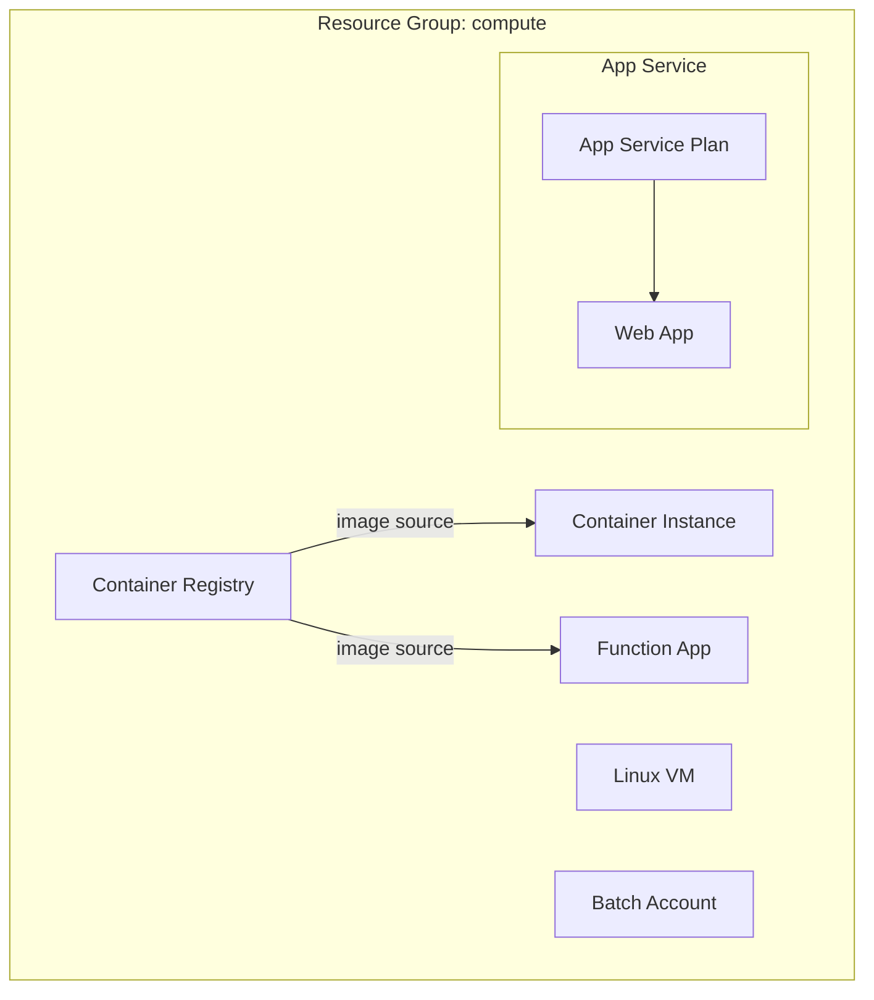

### Module 10 — Application Architecture

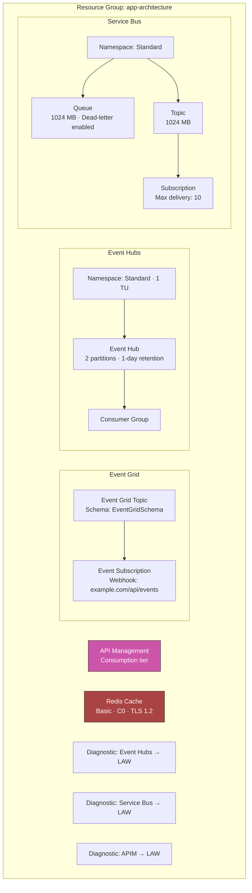

### Module 11 — Networking (Advanced)

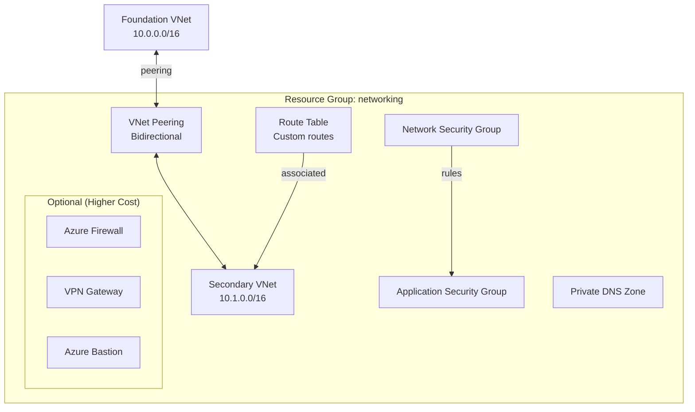

### Module 12 — Migration

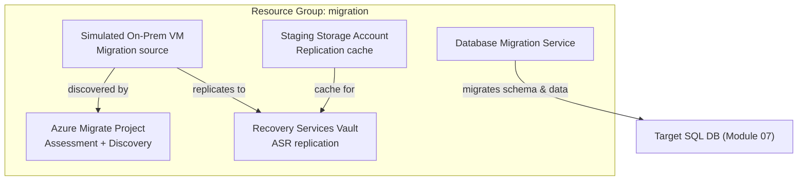

---

## 3. Resource Inventory Table

### Module 00 — Foundation

| Resource | Azure Resource Type | Purpose | Est. Monthly Cost |
|----------|-------------------|---------|-------------------|
| Resource Group | `azurerm_resource_group` | Container for foundation resources | Free |
| Virtual Network | `azurerm_virtual_network` | Primary VNet 10.0.0.0/16 | Free |
| Subnet: default | `azurerm_subnet` | General-purpose 10.0.0.0/24 | Free |
| Subnet: governance | `azurerm_subnet` | Governance module 10.0.1.0/24 | Free |
| Subnet: identity | `azurerm_subnet` | Identity module 10.0.2.0/24 | Free |
| Subnet: keyvault | `azurerm_subnet` | Key Vault module 10.0.3.0/24 | Free |
| Subnet: monitoring | `azurerm_subnet` | Monitoring module 10.0.4.0/24 | Free |
| Subnet: compute | `azurerm_subnet` | Compute module 10.0.5.0/24 | Free |
| Subnet: storage | `azurerm_subnet` | Storage module 10.0.6.0/24 | Free |
| Subnet: database | `azurerm_subnet` | Database module 10.0.7.0/24 | Free |
| Subnet: data-integration | `azurerm_subnet` | Data integration module 10.0.8.0/24 | Free |
| Subnet: app-architecture | `azurerm_subnet` | App architecture module 10.0.9.0/24 | Free |
| Subnet: networking | `azurerm_subnet` | Networking module 10.0.10.0/24 | Free |
| Subnet: migration | `azurerm_subnet` | Migration module 10.0.11.0/24 | Free |
| Subnet: AzureBastionSubnet | `azurerm_subnet` | Azure Bastion 10.0.250.0/24 | Free |
| Subnet: GatewaySubnet | `azurerm_subnet` | VPN/ER Gateway 10.0.251.0/24 | Free |
| Network Security Group | `azurerm_network_security_group` | Default NSG with 3 rules | Free |
| NSG Association | `azurerm_subnet_network_security_group_association` | NSG → default subnet | Free |
| Log Analytics Workspace | `azurerm_log_analytics_workspace` | Central logging (PerGB2018, 30-day) | ~$2–5 |
| Random Suffix | `random_string` | 6-char unique naming suffix | Free |

### Module 01 — Governance

| Resource | Azure Resource Type | Purpose | Est. Monthly Cost |
|----------|-------------------|---------|-------------------|
| Resource Group | `azurerm_resource_group` | Governance resources container | Free |
| Policy: Require CostCenter Tag | `azurerm_policy_definition` | Custom deny policy for tagging | Free |
| Policy: Restrict VM SKUs | `azurerm_policy_definition` | Custom deny policy limiting VM sizes | Free |
| Assignment: CostCenter Tag | `azurerm_resource_group_policy_assignment` | Enforce tag requirement | Free |
| Assignment: Allowed Locations | `azurerm_resource_group_policy_assignment` | Built-in policy — eastus only | Free |
| Assignment: Security Benchmark | `azurerm_resource_group_policy_assignment` | Built-in initiative — audit mode | Free |
| Custom Role: Lab Reader Plus | `azurerm_role_definition` | Read + VM ops + metrics | Free |
| Management Group | `azurerm_management_group` | Lab management group (conditional) | Free |
| Resource Lock | `azurerm_management_lock` | CanNotDelete on governance RG | Free |

### Module 02 — Identity

| Resource | Azure Resource Type | Purpose | Est. Monthly Cost |
|----------|-------------------|---------|-------------------|
| Resource Group | `azurerm_resource_group` | Identity resources container | Free |
| Entra ID Group: Admins | `azuread_group` | Security group for administrators | Free |
| Entra ID Group: Developers | `azuread_group` | Security group for developers | Free |
| Entra ID Group: Readers | `azuread_group` | Security group for read-only users | Free |
| App Registration | `azuread_application` | Lab application in Entra ID | Free |
| Service Principal | `azuread_service_principal` | Service identity for app registration | Free |
| Role Assignment: Readers | `azurerm_role_assignment` | Reader role on identity RG | Free |
| Role Assignment: Developers | `azurerm_role_assignment` | Contributor role on identity RG | Free |
| Conditional Access Policy | `azuread_conditional_access_policy` | MFA for admins (report-only, P1+ required) | Free* |
| Diagnostic Setting | `azurerm_monitor_aad_diagnostic_setting` | SignInLogs + AuditLogs → LAW | Free** |
| User-Assigned Managed Identity | `azurerm_user_assigned_identity` | Shared managed identity for modules | Free |

### Module 03 — Key Vault

| Resource | Azure Resource Type | Purpose | Est. Monthly Cost |
|----------|-------------------|---------|-------------------|
| Resource Group | `azurerm_resource_group` | Key Vault resources container | Free |
| Key Vault | `azurerm_key_vault` | Secrets/keys/certs management (standard SKU) | ~$0.03/op |
| Managed Identity | `azurerm_user_assigned_identity` | Identity for KV RBAC access | Free |
| Role: KV Administrator | `azurerm_role_assignment` | Current user admin access | Free |
| Role: KV Secrets User | `azurerm_role_assignment` | Managed identity secret read | Free |
| Role: KV Crypto User | `azurerm_role_assignment` | Managed identity key operations | Free |
| Secret: db-connection-string | `azurerm_key_vault_secret` | Demo database connection string | ~$0.03/10K ops |
| Key: RSA 2048 Encryption | `azurerm_key_vault_key` | Encryption key (software-protected) | ~$0.03/10K ops |
| Certificate: TLS Demo | `azurerm_key_vault_certificate` | Self-signed cert (12-month validity) | ~$3 |
| Private DNS Zone | `azurerm_private_dns_zone` | privatelink.vaultcore.azure.net | ~$0.50 |
| VNet Link | `azurerm_private_dns_zone_virtual_network_link` | DNS zone → VNet association | Free |
| Private Endpoint | `azurerm_private_endpoint` | Private access to Key Vault | ~$7.30 |
| Diagnostic Setting | `azurerm_monitor_diagnostic_setting` | AuditEvent + AllMetrics → LAW | Free** |

### Module 04 — Monitoring

| Resource | Azure Resource Type | Purpose | Est. Monthly Cost |
|----------|-------------------|---------|-------------------|
| Resource Group | `azurerm_resource_group` | Monitoring resources container | Free |
| Application Insights | `azurerm_application_insights` | APM (workspace-based, web type) | ~$2–5 |
| Action Group | `azurerm_monitor_action_group` | Email notification receiver | Free |
| Metric Alert: CPU | `azurerm_monitor_metric_alert` | CPU > 80% on VMs (severity 2) | ~$0.10 |
| Activity Log Alert | `azurerm_monitor_activity_log_alert` | Resource deletion detection | Free |
| Scheduled Query Alert | `azurerm_monitor_scheduled_query_rules_alert_v2` | KQL error event query (severity 2) | ~$1.50 |
| Subscription Diagnostic Setting | `azurerm_monitor_diagnostic_setting` | Activity log routing → LAW | Free** |
| Portal Dashboard | `azurerm_portal_dashboard` | Monitoring overview (4 tiles) | Free |

### Module 05 — HA/DR

| Resource | Azure Resource Type | Purpose | Est. Monthly Cost |
|----------|-------------------|---------|-------------------|
| Resource Group | `azurerm_resource_group` | HA/DR resources container | Free |
| SSH Key | `tls_private_key` | RSA 4096 key for VM access | Free |
| Availability Set | `azurerm_availability_set` | FD=2 UD=5 for VM placement | Free |
| NIC × 2 (AvSet) | `azurerm_network_interface` | NICs for availability set VMs | Free |
| NIC (Zone) | `azurerm_network_interface` | NIC for zone VM | Free |
| Linux VM × 2 (AvSet) | `azurerm_linux_virtual_machine` | B1s Ubuntu 22.04 in avail. set | ~$7.60 × 2 |
| Linux VM (Zone 1) | `azurerm_linux_virtual_machine` | B1s Ubuntu 22.04 in zone 1 | ~$7.60 |
| Auto-Shutdown × 3 | `azurerm_dev_test_global_vm_shutdown_schedule` | 22:00 UTC cost control | Free |
| Public IP | `azurerm_public_ip` | Static Standard IP for public LB | ~$3.65 |
| Public Load Balancer | `azurerm_lb` | Standard external LB | ~$18.25 |
| LB Backend Pool | `azurerm_lb_backend_address_pool` | Backend pool for avset VMs | Free |
| LB NIC Association × 2 | `azurerm_network_interface_backend_address_pool_association` | VMs → backend pool | Free |
| LB Health Probe | `azurerm_lb_probe` | TCP:80 health check (5s interval) | Free |
| LB Rule: HTTP | `azurerm_lb_rule` | Port 80 → 80 with TCP reset | Free |
| Internal Load Balancer | `azurerm_lb` | Standard internal LB (private IP) | ~$18.25 |
| Internal LB Backend Pool | `azurerm_lb_backend_address_pool` | Backend pool for internal LB | Free |
| Recovery Services Vault | `azurerm_recovery_services_vault` | Standard SKU, GeoRedundant | ~$10 |
| VM Backup Policy | `azurerm_backup_policy_vm` | Daily 02:00 UTC, 7-day retention | Included |
| Backup Protected VM × 2 | `azurerm_backup_protected_vm` | AvSet VMs registered for backup | ~$5 × 2 |
| Traffic Manager Profile | `azurerm_traffic_manager_profile` | Performance routing, 60s TTL | ~$0.75 |
| Traffic Manager Endpoint | `azurerm_traffic_manager_azure_endpoint` | Points to public LB IP | Included |

### Module 06 — Storage

| Resource | Azure Resource Type | Purpose | Est. Monthly Cost |
|----------|-------------------|---------|-------------------|
| Resource Group | `azurerm_resource_group` | Storage resources container | Free |
| Storage Account: GPv2 | `azurerm_storage_account` | General-purpose Standard LRS | ~$1–3 |
| Storage Account: Premium | `azurerm_storage_account` | Premium Blob performance tier | ~$2–5 |
| Storage Account: Data Lake | `azurerm_storage_account` | ADLS Gen2 (HNS enabled) | ~$1–3 |
| Blob Containers | `azurerm_storage_container` | Object storage containers | Free |
| File Share | `azurerm_storage_share` | SMB file share | ~$1 |
| Lifecycle Rules | `azurerm_storage_management_policy` | Cool → Archive tiering automation | Free |
| Managed Disks | `azurerm_managed_disk` | Standalone disk resources | ~$1–5 |
| Private Endpoint | `azurerm_private_endpoint` | Private access to storage | ~$7.30 |

### Module 07 — Databases

| Resource | Azure Resource Type | Purpose | Est. Monthly Cost |
|----------|-------------------|---------|-------------------|
| Resource Group | `azurerm_resource_group` | Database resources container | Free |
| Azure SQL Server | `azurerm_mssql_server` | Logical SQL server | Free |
| SQL DB: Basic DTU | `azurerm_mssql_database` | DTU-based pricing (Basic tier, 5 DTUs) | ~$4.90 |
| SQL DB: Serverless vCore | `azurerm_mssql_database` | Serverless with auto-pause | ~$5–15 |
| Elastic Pool | `azurerm_mssql_elasticpool` | Shared DTU/vCore pool | ~$15–30 |
| CosmosDB Account | `azurerm_cosmosdb_account` | Serverless NoSQL database | ~$0–5 |
| Private Endpoint | `azurerm_private_endpoint` | Private access to SQL Server | ~$7.30 |

### Module 08 — Data Integration

| Resource | Azure Resource Type | Purpose | Est. Monthly Cost |
|----------|-------------------|---------|-------------------|
| Resource Group | `azurerm_resource_group` | Data integration resources container | Free |
| Data Factory | `azurerm_data_factory` | ETL/ELT orchestration | ~$0–5 |
| Linked Service | `azurerm_data_factory_linked_service_*` | Connection to data stores | Free |
| Pipeline | `azurerm_data_factory_pipeline` | Data movement pipeline | Free |
| Data Lake Gen2 | `azurerm_storage_account` | Medallion architecture store (HNS) | ~$1–3 |
| Containers: bronze/silver/gold | `azurerm_storage_container` | Medallion layer containers | Free |
| Event Grid Topic | `azurerm_eventgrid_topic` | Event-driven pipeline triggers | ~$0.60 |

### Module 09 — Compute

| Resource | Azure Resource Type | Purpose | Est. Monthly Cost |
|----------|-------------------|---------|-------------------|
| Resource Group | `azurerm_resource_group` | Compute resources container | Free |
| Linux VM | `azurerm_linux_virtual_machine` | IaaS compute demo | ~$7.60 |
| App Service Plan | `azurerm_service_plan` | Hosting plan for web app | ~$13–55 |
| Web App | `azurerm_linux_web_app` | PaaS web application | Included |
| Container Instance | `azurerm_container_group` | Serverless container | ~$1–3 |
| Container Registry | `azurerm_container_registry` | Private image registry | ~$5 |
| Function App | `azurerm_linux_function_app` | Serverless compute | ~$0–2 |
| Batch Account | `azurerm_batch_account` | Batch processing | ~$0–1 |

### Module 10 — App Architecture

| Resource | Azure Resource Type | Purpose | Est. Monthly Cost |
|----------|-------------------|---------|-------------------|
| Resource Group | `azurerm_resource_group` | App architecture resources container | Free |
| Event Grid Topic | `azurerm_eventgrid_topic` | Custom event publishing | ~$0.60 |
| Event Grid Subscription | `azurerm_eventgrid_event_subscription` | Webhook event delivery | Free |
| Event Hubs Namespace | `azurerm_eventhub_namespace` | Standard tier, 1 TU | ~$11 |
| Event Hub | `azurerm_eventhub` | 2 partitions, 1-day retention | Included |
| Consumer Group | `azurerm_eventhub_consumer_group` | Parallel event processing | Free |
| Service Bus Namespace | `azurerm_servicebus_namespace` | Standard tier messaging | ~$10 |
| Service Bus Queue | `azurerm_servicebus_queue` | 1024 MB, dead-letter enabled | Included |
| Service Bus Topic | `azurerm_servicebus_topic` | 1024 MB pub/sub topic | Included |
| Service Bus Subscription | `azurerm_servicebus_subscription` | Topic subscriber (max delivery: 10) | Included |
| API Management | `azurerm_api_management` | Consumption tier API gateway | ~$3.50 |
| Redis Cache | `azurerm_redis_cache` | Basic C0, TLS 1.2 | ~$16 |
| Diagnostic: Event Hubs | `azurerm_monitor_diagnostic_setting` | ArchiveLogs + OperationalLogs → LAW | Free** |
| Diagnostic: Service Bus | `azurerm_monitor_diagnostic_setting` | OperationalLogs → LAW | Free** |
| Diagnostic: APIM | `azurerm_monitor_diagnostic_setting` | GatewayLogs → LAW | Free** |

### Module 11 — Networking

| Resource | Azure Resource Type | Purpose | Est. Monthly Cost |
|----------|-------------------|---------|-------------------|
| Resource Group | `azurerm_resource_group` | Networking resources container | Free |
| Secondary VNet | `azurerm_virtual_network` | Second VNet 10.1.0.0/16 | Free |
| VNet Peering (primary → secondary) | `azurerm_virtual_network_peering` | Bidirectional peering | ~$0 (data transfer) |
| VNet Peering (secondary → primary) | `azurerm_virtual_network_peering` | Bidirectional peering | ~$0 (data transfer) |
| NSG | `azurerm_network_security_group` | Secondary VNet security rules | Free |
| Application Security Group | `azurerm_application_security_group` | Logical grouping for NSG rules | Free |
| Route Table | `azurerm_route_table` | Custom routing rules | Free |
| Private DNS Zone | `azurerm_private_dns_zone` | Internal name resolution | ~$0.50 |
| Azure Firewall (optional) | `azurerm_firewall` | Central network filtering | ~$912 |
| VPN Gateway (optional) | `azurerm_virtual_network_gateway` | Hybrid connectivity | ~$138 |
| Azure Bastion (optional) | `azurerm_bastion_host` | Secure VM access | ~$138 |

### Module 12 — Migration

| Resource | Azure Resource Type | Purpose | Est. Monthly Cost |
|----------|-------------------|---------|-------------------|
| Resource Group | `azurerm_resource_group` | Migration resources container | Free |
| Azure Migrate Project | `azurerm_resource_group_template_deployment` | Assessment and discovery | Free |
| Recovery Services Vault | `azurerm_recovery_services_vault` | ASR replication target | ~$10–25 |
| Database Migration Service | `azurerm_database_migration_service` | SQL migration tooling | ~$40–80 |
| Staging Storage Account | `azurerm_storage_account` | ASR replication cache | ~$1–3 |
| Simulated On-Prem VM | `azurerm_linux_virtual_machine` | Migration source (demo) | ~$7.60 |

> \* Free with Entra ID Free tier; Conditional Access requires P1+ license.
> \** Log ingestion costs are billed through the Log Analytics Workspace (Module 00).

---

## 4. Dependency Map

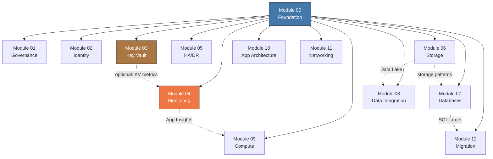

### Dependency Details

| Module | Hard Dependencies | Soft / Optional References |
|--------|-------------------|---------------------------|
| **00 — Foundation** | None (root module) | — |
| **01 — Governance** | 00: resource group, subscription | — |
| **02 — Identity** | 00: resource group, LAW | — |
| **03 — Key Vault** | 00: VNet, keyvault subnet, LAW | — |
| **04 — Monitoring** | 00: resource group, LAW | 03: Key Vault metrics (optional) |
| **05 — HA/DR** | 00: compute subnet, LAW | — |
| **06 — Storage** | 00: VNet, storage subnet, LAW | — |
| **07 — Databases** | 00: VNet, database subnet, LAW | 06: storage patterns reference |
| **08 — Data Integration** | 00: VNet, data-integration subnet, LAW | 06: Data Lake Gen2 |
| **09 — Compute** | 00: VNet, compute subnet, LAW | 04: Application Insights |
| **10 — App Architecture** | 00: LAW | — |
| **11 — Networking** | 00: VNet (for peering) | — |
| **12 — Migration** | 00: VNet, migration subnet, LAW | 07: SQL target for DMS |

---

## 5. Network Topology Diagram

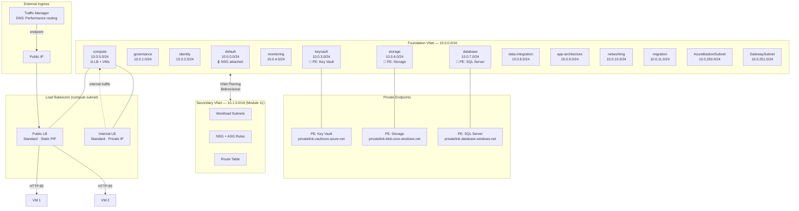

---

## 6. Exam Domain Mapping

The AZ-305 exam is organized into four weighted domains. Each lab module maps to one or more domains:

| Exam Domain | Weight | Modules | Key Resources |
|-------------|--------|---------|---------------|
| **Design identity, governance, and monitoring solutions** | 25–30% | 01 (Governance), 02 (Identity), 04 (Monitoring) | Policy definitions & assignments, custom RBAC role, management groups, resource locks, Entra ID groups, app registration, service principal, managed identity, conditional access, Application Insights, action groups, metric/log/activity alerts, dashboard, diagnostic settings |
| **Design data storage solutions** | 20–25% | 03 (Key Vault), 06 (Storage), 07 (Databases) | Key Vault (secrets, keys, certs, RBAC auth, private endpoint), GPv2/Premium/Data Lake storage accounts, blob containers, file shares, lifecycle management, managed disks, SQL Server (DTU + serverless vCore), elastic pool, CosmosDB (serverless) |
| **Design business continuity solutions** | 15–20% | 05 (HA/DR), 12 (Migration) | Availability sets & zones, public/internal load balancers, Recovery Services Vault, VM backup policies, Traffic Manager (performance routing), Azure Migrate, Database Migration Service, ASR replication |
| **Design infrastructure solutions** | 25–30% | 00 (Foundation), 08 (Data Integration), 09 (Compute), 10 (App Architecture), 11 (Networking) | VNet with 14 subnets, NSG, Data Factory (pipelines, linked services), Data Lake medallion architecture, Event Grid, Linux VMs, App Service, Container Instances, Container Registry, Function Apps, Batch, Event Hubs, Service Bus (queues + topics), API Management, Redis Cache, VNet peering, route tables, ASG, private DNS zones, (optional: Firewall, VPN Gateway, Bastion) |

### Module-to-Domain Cross-Reference

| Module | Identity/Governance/Monitoring | Data Storage | Business Continuity | Infrastructure |
|--------|:---:|:---:|:---:|:---:|
| 00 — Foundation | | | | ✅ |
| 01 — Governance | ✅ | | | |
| 02 — Identity | ✅ | | | |
| 03 — Key Vault | | ✅ | | |
| 04 — Monitoring | ✅ | | | |
| 05 — HA/DR | | | ✅ | |
| 06 — Storage | | ✅ | | |
| 07 — Databases | | ✅ | | |
| 08 — Data Integration | | | | ✅ |
| 09 — Compute | | | | ✅ |
| 10 — App Architecture | | | | ✅ |
| 11 — Networking | | | | ✅ |
| 12 — Migration | | | ✅ | |
